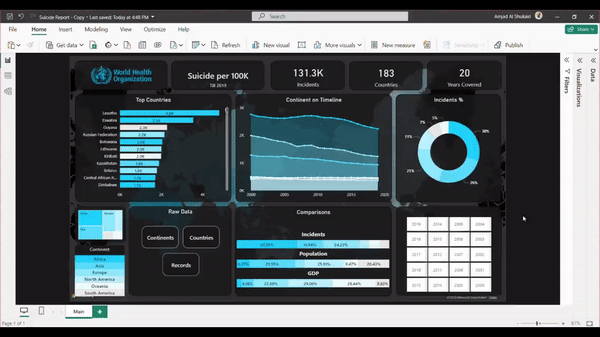
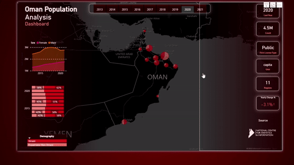

# 🚀 Business Intelligence Developer Challenge 🚀

Welcome to the Business Intelligence Developer challenge! We're thrilled to assess your skills in various aspects of Business Intelligence development. Please carefully review the guidelines before you begin.

## Example GIFs

## Main Knowledge Axes:

### 1. Connectivity
- **🔍 M-Query:** Understand and demonstrate proficiency in M-Query for effective data transformation.
- **🔧 Query Engineering:** Showcase your ability to engineer queries to optimize data retrieval and processing.

### 2. Data Modelling
- **🔄 Model Multiple Relative Data Sources:** Demonstrate your skills in modeling by integrating and managing data from multiple sources.

### 3. Data Analysis
- **📊 DAX (Data Analysis Expressions) / Or Any Other Measurement Builders:**
  - Create Calculated Tables, Columns, and Measures to extract meaningful insights from the data.

## Sub-Topics:

### 1. UI/UX
- **🎨 Layouting:** Design visually appealing and user-friendly dashboards.
- **✨ Aesthetics and CSS Animation:** Enhance the user experience through thoughtful aesthetics and CSS animations.

### 2. Actions
- **🚀 Navigation and Perspective Bookmarks:** Implement effective navigation and use perspective bookmarks.
- **🗺️ Page Navigation:** Showcase your skills in creating seamless transitions between pages.
- **🔍 Drill Through Filters:** Demonstrate the use of drill-through filters for in-depth analysis.

### 3. Security
- **🔐 Row Level Permissions:** Implement and showcase your understanding of row-level permissions to ensure data security.

## Instructions for the Challenge:

1. Choose any Business Intelligence (BI) tool of your preference.
2. Create a public repository to upload your work.
3. Select an open data type as an example for your BI project.
4. Clone this repository and create a branch with your name or put it in main.
5. Complete each section according to the specified requirements using your chosen BI tool and the selected open data type.
6. Clearly document your thought process and any assumptions made.
7. Provide clear and concise explanations for your code and solutions.
8. Once completed, submit a the repo link via the contact email at the end.

## Evaluation Criteria:
Your submission will be evaluated based on the following weighted criteria:

### Main Knowledge Axes (60%):
- Accuracy and effectiveness of data transformation and modeling: 20%
- Proficiency in BI expressions for data analysis: 20%
- Creativity and attention to detail in UI/UX design: 20%

### Sub-Topics (30%):
- Implementation of navigation and interaction features: 10%
- Robust implementation of data-level security: 10%
- Implementation of sub-topics within each main axis: 10%

## Good luck! We look forward to reviewing your submission. 🌟

- Please submit your BI Project Repository to amjad.alshukiri@gmail.com.

## Evaluation Criteria:
My submission should be evaluated based on the following weighted criteria:

### Main Knowledge Axes (60%):
- Accuracy and effectiveness of data transformation and modeling: 20%
- Proficiency in BI expressions for data analysis: 20%
- Creativity and attention to detail in UI/UX design: 20%

### Sub-Topics (30%):
- Implementation of navigation and interaction features: 10%
- Robust implementation of data-level security: 10%
- Implementation of sub-topics within each main axis: 10%

## Good luck! We look forward to reviewing your submission. 🌟

- Please submit your BI Project Repository to amjad.alshukiri@gmail.com.
